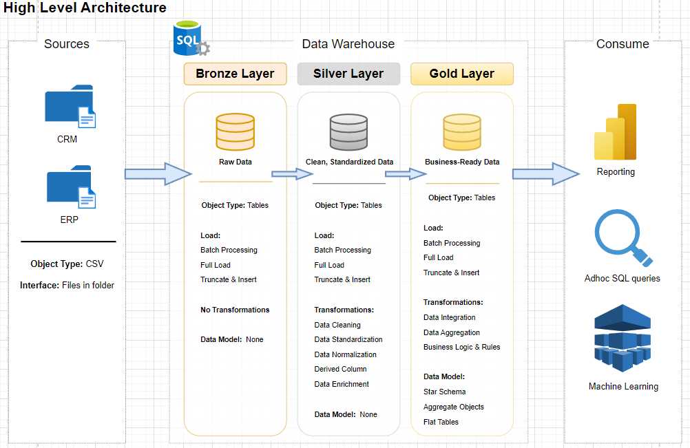

# SQL Data Warehouse Project
Building a modern data warehouse with SQL server, including ETL processes, data modeling, and analysis.

---
##  Data Architecture

The data architecture used in this project is Medallion architecture: **Bronze, Silver, Gold** layers

1. Bronze Layer: Stores raw data from the source system without any changes.
2. Silver Layer: Data are cleansed, standardized,  and normalized for analysis.
3. Gold Layer: Business-ready data for reporting and analysis.

---
## Project Requirements

---
## License
This project is licensed under the MIT License. You are free to use, modify, and share this project with proper attribution.
